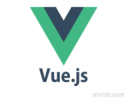

# 차근차근 시작하기

## Vue-CLI
"Real" 한 Vue 개발 플로우를 위해 Vue-CLI 를 사용합니다.
Vue-CLI 는 빠른 Vue 개발을 위한 세팅이 이루어져 있는 작업환경입니다.

<Counter/>

<!-- Italics -->
*This text* is italic
_This text_ is italic

<!-- Strongs -->

**This text** is bold

__This text__ is bold

<!-- Strikethrough -->

~~This text~~ is strikethrough

<!-- Horizontal Rule -->
___
---

<!-- Blockquote -->
> This is a quote

<!-- Links -->
[Google](https://google.com)
[Google](https://google.com "Google링크")

<!-- UL -->
* Item 1
* Item 2
* Item 3
  * Nested Item 1
  * Nested Item 2

<!-- OL -->
1. Item 1
1. Item 2
1. Item 3

<!-- Inline Code Block -->
`<p>This is a paragraph</p>`

<!-- Images -->



<!-- Github Markdonw -->

## Code Blocks
<!-- Code Blocks -->
```bash
  npm install 
  npm start
```

```javascript
function add(num1, num2) {
  return num1 + num2
}

```

```python
def add(num1, num2):
  return num1 + num2
```

<!-- Tables -->
|Name|Email|
|------|------|
|John Doe|john@gmail.com|
|Jane Doe|jane@gmail.com|

<!-- Task Lists -->
* [x] Task 1
* [x] Task 2
* [ ] Task 3
